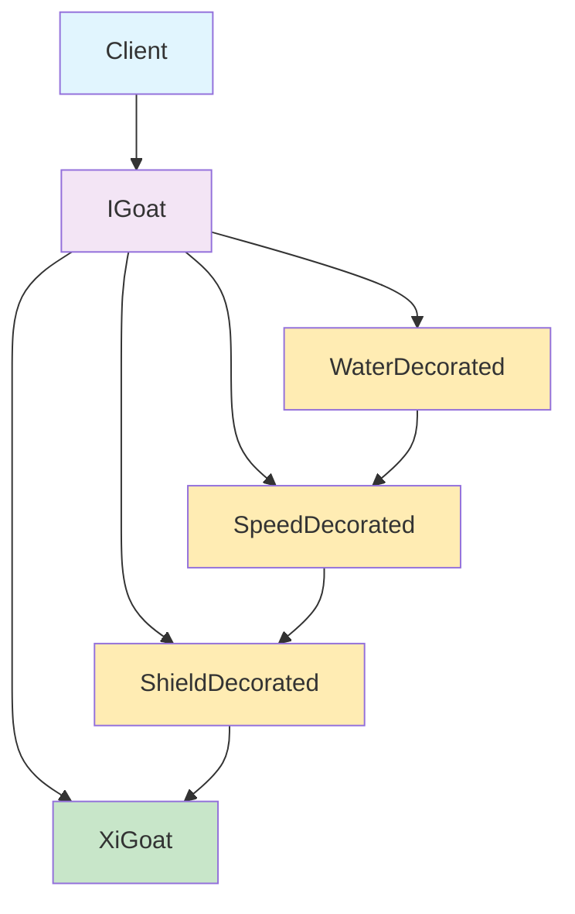

# 装饰器模式阅读理解文档

## 📖 什么是装饰器模式？

装饰器模式（Decorator Pattern）是一种结构型设计模式，它允许在不改变现有对象结构的情况下，动态地为对象添加新的功能。就像给房子装修一样，不改变房子的基本结构，但可以添加不同的装饰。

## 🎯 核心思想

**"组合优于继承"** - 通过包装对象来扩展功能，而不是通过继承来创建子类。

## 🏗️ 装饰器模式的四个角色

### 1. Component（组件接口）
```java
public interface IGoat {
    void flee();
    void loseLife();
    int getLives();
}
```
- 定义了被装饰对象的基本行为
- 所有具体组件和装饰器都需要实现这个接口

### 2. ConcreteComponent（具体组件）
```java
public class XiGoat implements IGoat {
    // 具体的实现，是被装饰的原始对象
}
```
- 实现了Component接口
- 是真正被装饰的对象
- 提供了基本功能

### 3. Decorator（装饰器基类）
```java
public abstract class DecoratedGoat implements IGoat {
    protected IGoat decoratedGoat;

    public DecoratedGoat(IGoat goat) {
        this.decoratedGoat = goat;
    }

    @Override
    public void flee() {
        decoratedGoat.flee();  // 默认转发
    }
}
```
- 实现Component接口（它是一只被装饰过的羊）
- 持有一个Component对象的引用（它装饰着另一只羊）
- 将方法调用转发给被装饰的对象

**设计精髓：** 既是装饰器，又是被装饰的对象！

### 4. ConcreteDecorator（具体装饰器）
```java
public class ShieldDecorated extends DecoratedGoat {
    @Override
    public void flee() {
        System.out.print("【开启保护罩！】-> ");
        super.flee();  // 添加新功能，然后调用原始方法
    }
}
```
- 继承Decorator类（它是一只有特定装饰能力的羊）
- 为组件添加具体的新功能（它装饰着羊，同时自己也是羊）
- 可以在调用原始方法前后添加额外行为

**命名智慧：** `ShieldDecorated` - "被保护罩装饰过的羊"，更直观体现对象的真实性质

## 🔄 装饰器的工作流程



**装饰器链的形成：**
1. 原始对象：`XiGoat`
2. 第一次装饰：`ShieldDecorated(XiGoat)`
3. 第二次装饰：`SpeedDecorated(ShieldDecorated(XiGoat))`
4. 第三次装饰：`WaterDecorated(SpeedDecorated(ShieldDecorated(XiGoat)))`

## 💡 为什么使用装饰器模式？

### 问题场景
如果使用继承来实现喜羊羊的能力组合：
- 保护罩：`XiGoatWithShield`
- 速度：`XiGoatWithSpeed`
- 趟水：`XiGoatWithWater`
- 保护罩+速度：`XiGoatWithShieldAndSpeed`
- 保护罩+趟水：`XiGoatWithShieldAndWater`
- 速度+趟水：`XiGoatWithSpeedAndWater`
- 保护罩+速度+趟水：`XiGoatWithAll`

**需要 2³ = 8 个子类！**

### 装饰器模式的解决方案
- 1个原始组件：`XiGoat`
- 1个装饰器基类：`DecoratedGoat`
- 3个具体装饰器：`ShieldDecorated`, `SpeedDecorated`, `WaterDecorated`

**总共只需要 5 个类！**

## ✨ 装饰器模式的优势

### 1. 避免继承爆炸
- 不需要为每种功能组合创建单独的子类
- 大大减少类的数量

### 2. 动态扩展功能
- 在运行时决定使用哪些装饰器
- 可以任意顺序组合装饰器

### 3. 符合开闭原则
- 新增装饰器不需要修改现有代码
- 对扩展开放，对修改关闭

### 4. 保持接口一致性
- 装饰后的对象仍然实现相同的接口
- 客户端代码无需修改

## 🎮 游戏场景中的应用

在我们的"喜羊羊逃命"游戏中：

### 基础组件
```java
IGoat xiyangyang = new XiGoat();  // 基础喜羊羊
```

### 逐步装饰
```java
// 吃到红苹果，获得保护罩
xiyangyang = new ShieldDecorated(xiyangyang);

// 吃到绿苹果，获得速度
xiyangyang = new SpeedDecorated(xiyangyang);

// 吃到黄苹果，获得趟水能力
xiyangyang = new WaterDecorated(xiyangyang);
```

### 效果叠加
最终的调用链：
```
WaterDecorated.flee()
    ↓
SpeedDecorated.flee()
    ↓
ShieldDecorated.flee()
    ↓
XiGoat.flee()
```

输出结果：
```
【学会了趟水跑！】-> 【奔跑速度加快！】-> 【开启保护罩！】-> 喜羊羊正在拼命逃跑！
```

## 🔍 装饰器模式 vs 继承

| 特征 | 装饰器模式 | 继承 |
|------|------------|------|
| 扩展方式 | 组合 | 继承 |
| 类的数量 | O(n) | O(2^n) |
| 灵活性 | 运行时动态组合 | 编译时静态决定 |
| 功能叠加 | 可以任意叠加 | 需要大量子类 |
| 符合SOLID | 符合开闭原则 | 违反开闭原则 |

## 🚀 使用时机

### 适合使用装饰器模式的场景：

1. **需要动态添加功能**
   - 不能预知对象需要哪些功能
   - 功能需要在运行时决定

2. **避免继承爆炸**
   - 多种功能需要组合使用
   - 继承会导致类数量激增

3. **需要透明扩展**
   - 不影响现有接口
   - 客户端代码无需修改

4. **功能可以任意组合**
   - 不同功能之间没有依赖关系
   - 可以任意顺序叠加

### 实际应用场景：

1. **Java I/O流**
   ```java
   InputStream in = new BufferedInputStream(
       new DataInputStream(
           new FileInputStream("file.txt")
       )
   );
   ```

2. **GUI组件**
   - 为文本框添加滚动条
   - 为窗口添加边框
   - 为按钮添加图标

3. **Web开发**
   - HTTP请求/响应装饰器
   - 中间件链

4. **游戏开发**
   - 角色技能组合
   - 装备属性叠加

## 📝 实现要点

### 1. 接口设计
- Component接口要定义所有核心方法
- 确保装饰器和组件实现相同接口

### 2. 装饰器基类
- 持有Component的引用（既是羊，又装饰着羊）
- 默认将所有调用转发给被装饰对象
- 为子类提供扩展点
- 实现"既是装饰器，又是被装饰对象"的设计精髓

### 3. 具体装饰器
- 只关注自己要添加的功能（专注于特定装饰能力）
- 在适当的地方调用父类方法（保持装饰链完整性）
- 不要忘记转发不需要修改的方法
- 命名体现"被装饰"的本质（如：ShieldDecorated - 被保护罩装饰过的羊）

### 4. 使用方式
- 先创建原始组件
- 逐步用装饰器包装
- 通过最外层的装饰器调用方法

## 🔄 设计方案对比

### 方案一：内置装饰器（替代方案）
```java
public interface IGoat {
    void flee();
    void loseLife();
    int getLives();

    // 添加装饰器属性
    void setDecorator(IGoatDecorator decorator);
    IGoatDecorator getDecorator();
}

public class XiGoat implements IGoat {
    private int lives = 5;
    private IGoatDecorator decorator;  // 内置装饰器

    @Override
    public void flee() {
        if (decorator != null) {
            decorator.decorateFlee(this);  // 装饰后再执行
        }
        System.out.println("喜羊羊正在拼命逃跑！");
    }

    // 其他方法...
}
```

### 方案二：外层包装（经典装饰器模式）
```java
public abstract class DecoratedGoat implements IGoat {
    protected IGoat decoratedGoat;

    public DecoratedGoat(IGoat goat) {
        this.decoratedGoat = goat;
    }

    @Override
    public void flee() {
        decoratedGoat.flee();
    }
}
```

## 📊 详细对比分析

| 对比维度 | 内置装饰器 | 外层包装（经典） |
|---------|-----------|----------------|
| **装饰次数** | ❌ 只能装饰一次 | ✅ 可无限次装饰 |
| **装饰链** | ❌ 无法形成链式结构 | ✅ 支持复杂装饰链 |
| **对象身份** | ✅ 保持原始对象身份 | ❌ 每次装饰产生新对象 |
| **内存使用** | ✅ 节省内存，一个对象 | ❌ 多个装饰器对象 |
| **代码复杂度** | ✅ 相对简单 | ❌ 需要额外抽象类 |
| **运行时灵活性** | ❌ 只能切换单个装饰器 | ✅ 可动态组合多种装饰器 |
| **向后兼容** | ❌ 需要修改接口 | ✅ 不修改原始接口 |
| **线程安全** | ❌ 装饰器属性可能并发修改 | ✅ 每个对象独立，更安全 |

## 🎯 关键差异分析

### 1. 装饰能力的根本差异

**内置装饰器的问题：**
```java
IGoat xiyangyang = new XiGoat();
xiyangyang.setDecorator(new ShieldDecorator());  // ✅ 可以
xiyangyang.setDecorator(new SpeedDecorator());   // ❌ 会覆盖前面的保护罩！

// 无法同时拥有多种装饰！
```

**经典装饰器的优势：**
```java
IGoat xiyangyang = new XiGoat();
xiyangyang = new ShieldDecorated(xiyangyang);     // ✅ 添加保护罩
xiyangyang = new SpeedDecorated(xiyangyang);      // ✅ 添加速度
xiyangyang = new WaterDecorated(xiyangyang);      // ✅ 添加趟水能力
// 最终拥有全部三种能力！
```

### 2. 设计原则的对比

**内置装饰器：**
- ✅ 保持对象身份：还是原来的那个对象
- ❌ 违反单一职责：羊类需要管理装饰器
- ❌ 违反开闭原则：需要修改原有接口

**经典装饰器：**
- ❌ 改变对象身份：每次装饰都是新对象
- ✅ 符合单一职责：每个类只负责自己的功能
- ✅ 符合开闭原则：不修改原有代码

### 3. 使用场景分析

**内置装饰器适用场景：**
- 只需要单一装饰功能
- 强调保持对象原始身份
- 内存敏感的环境
- 简单的功能增强

**经典装饰器适用场景：**
- 需要多种功能组合
- 需要动态调整功能组合
- 符合SOLID原则要求
- 复杂的功能扩展需求

## 🎯 总结

装饰器模式是一种优雅的扩展对象功能的方式，它：

- **解决了继承的局限性**：避免了类数量爆炸
- **提供了运行时灵活性**：可以动态组合功能
- **保持了代码的可维护性**：符合开闭原则
- **增强了系统的可扩展性**：易于添加新功能
- **支持无限次装饰**：这是相比内置装饰器的核心优势

**关键优势对比：**
- **内置装饰器**：简单、节省内存，但只能装饰一次
- **经典装饰器**：支持复杂装饰链，符合设计原则，但需要更多对象

通过"喜羊羊逃命"这个例子，我们可以看到装饰器模式如何优雅地解决了能力组合的问题，让代码更加清晰、灵活和可维护。选择哪种方案取决于具体的需求和约束条件。